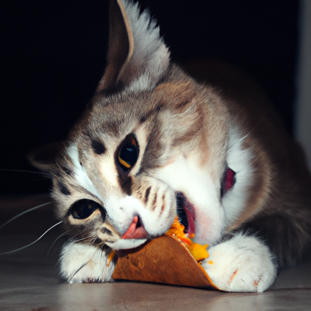

# chatGPToot 🦣 -- Mastodon OpenAI Chatbot 🤖

### This is a Mastodon chatbot that uses OpenAI to generate responses. The bot can post toots and DALL-E images based on a pre-written prompt or respond to direct mentions.

---

## Installation

-   Clone the repository: `git clone https://github.com/skullzarmy/chatGPToot.git`
-   `npm install` to initiate node and install dependencies
-   `npm run setup` will create needed folders and `.env` file
-   edit `.env` file and add your credentials

---

## Arguments

### The following arguments are available for `chatgptoot.js`:

`--no-loop` - Disables the automatic toot, image, and mention loops. This is useful if you want to run the script manually to test it.

`--no-image` - Disables the automatic image loop.

`--no-toot` - Disables the automatic toot loop.

`--no-mention` - Disables the automatic mention loop.

`--toot-now` - Generates a toot and posts it immediately.

`--image-now` - Generates an image prompt and posts it immediately.

---

## Example Usage

`npm run bot` will run the bot in a loop, tooting, mentioning, and posting images.

`npm run bot-mention` will run the bot in a loop, mentioning but not tooting or posting images.

`npm run bot-image` will run the bot in a loop, posting images but not tooting or mentioning.

`npm run bot-toot` will run the bot in a loop, tooting but not mentioning or posting images.

`npm run single-toot` will run the bot once, tooting but not mentioning or posting images.

`npm run single-image` will run the bot once, posting images but not tooting or mentioning.

`npm run single-mention` will run the bot once, mentioning but not tooting or posting images.

`npm run tail-logs` will stream the new bot logs to your terminal.

---

## Mention Commands

The bot supports the following commands when responding to a mention:

_command must be at the beginning of the mention (after the @mention)_

-   "//image//" - Treats as an image prompt, generates a DALL-E image, and posts it in reply
-   "//help//" or "//commands//" - Posts a list of commands in reply

### Example

`@chatGPToot //image// a cat eating a taco`

---

## Usage Logging Utilities

By default, the bot will log all usage to logs/usage_logs.json

`npm run usage` will print and save a usage summary to

---

## License

This project is released under the [MIT License](LICENSE.txt). You are free to use, modify, and distribute the source code, subject to the terms and conditions of the license.

The [MIT License](LICENSE.txt) is a permissive open-source software license that allows you to use this project for any purpose, including commercial use. By using this project, you agree to retain the original copyright notice and the full license text in all copies or substantial portions of the software.

We encourage collaboration and contribution to the project. Feel free to fork, modify, and share your improvements with the community. Our goal is to make this software as useful and accessible as possible, and your contributions will help us achieve that.

Please note that this project is provided "as is" without any warranty or liability. The authors are not responsible for any consequences that may arise from the use of this software.
